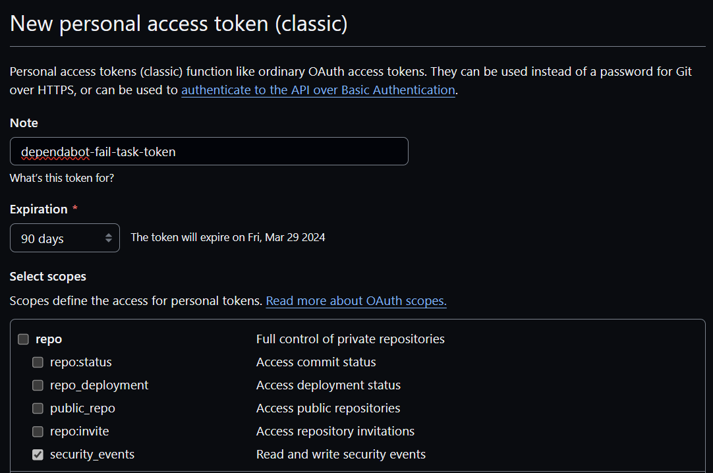

# Token Generation

---

[GitHub Documentation](https://docs.github.com/en/authentication/keeping-your-account-and-data-secure/managing-your-personal-access-tokens)

In order to get the correct information from the API, you should specify
the scope `repo:security_events`.

---

If you are retrieving alerts for a GitHub organisation that uses SSO, you must
authorise the token to work in the organisation once it is created.

See here for additional info:
[GitHub Documentation: SAML Authentication](https://docs.github.com/en/enterprise-cloud@latest/authentication/authenticating-with-saml-single-sign-on/authorizing-a-personal-access-token-for-use-with-saml-single-sign-on)
